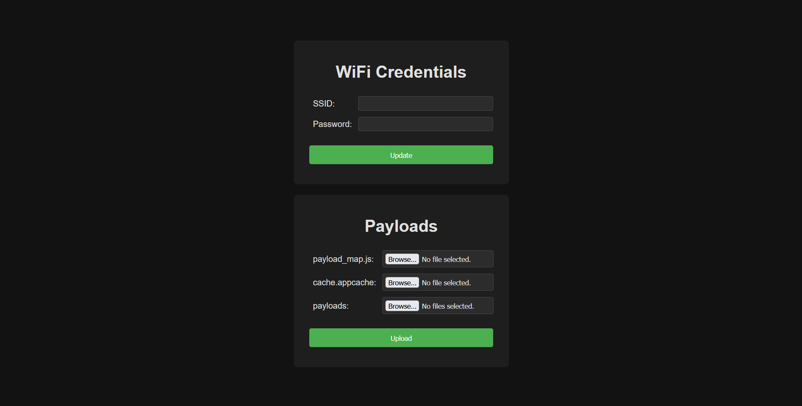

# ESP8266 PlayStation 5 Web Exploit Server

Lightweight web server for ESP8266 that hosts the [PlayStation 5 UMTX2 Jailbreak](https://github.com/idlesauce/umtx2) for firmware versions 1.00–5.50, with minor modifications to enable caching. The following payloads are preloaded: [etaHEN v2.1b](https://github.com/etaHEN/etaHEN/releases/tag/2.1B), [byepervisor](https://github.com/PS5Dev/Byepervisor), [kstuff](https://github.com/EchoStretch/kstuff), [kstuff-toggle](https://github.com/EchoStretch/kstuff-toggle), [ftpsrv](https://github.com/ps5-payload-dev/ftpsrv) and [elfldr](https://github.com/ps5-payload-dev/elfldr).

**Note: ESP32 support will be added in the coming weeks, once I get my hands on one.**

## Quick Setup Guide

### WiFi Details

- SSID: `PS5_WEB_AP`
- Password: `password`

### Step-by-Step Installation and Usage

1. Download and install [NodeMCU PyFlasher](https://github.com/marcelstoer/nodemcu-pyflasher). You will use this tool to flash the precompiled `.bin` file.

2. **(Skip this step if you have ESP Host FPKG installed on your PS5!)** Download the `esp8266-nopayloads-nocache.bin` file from the [releases page](https://github.com/vladimir-cucu/esp-ps5-exploit-server/releases) and flash it to your ESP8266. Connect your PS5 to the ESP8266's WiFi and open the User's Guide to access the exploit page. After successfully jailbreaking your PS5, install [ESP Host FPKG](https://www.mediafire.com/file/w4e6hiuwfoj8dnb/esphost.zip) and follow the next step.

3. Download the `esp8266-ps5-exploit-server-v1.xx.bin` file from the [releases page](https://github.com/vladimir-cucu/esp-ps5-exploit-server/releases) and flash it to your ESP8266. Connect your PS5 to the ESP8266's WiFi and access the exploit page through ESP Host FPKG. Once the page is cached, you can disconnect from the internet and jailbreak your PS5 offline in the future.

### Why are there two different `.bin` files?

**Issue with User's Guide:** All ESP PS5 servers host the exploit at IP `10.1.1.1` for compatibility reasons with ESP Host FPKG. If you have a previously cached version of the exploit in the User's Guide that redirects to `http://10.1.1.1/index.html`, you will not be able to use any other version of the exploit that redirects to the same URL until you clear the cache with [Storm21CH's PS5_Browser_appCache_remove](https://github.com/Storm21CH/PS5_Browser_appCache_remove). Unfortunately, this payload doesn't work with UMTX2 and, even if it worked, you have to run it before flashing the new version of the exploit.

The `esp8266-nopayloads-nocache.bin` file is intended for **one-time use** during the initial installation to bypass the aforementioned issue. It does not have any payloads, it does not cache the exploit and it serves the exploit at a different URL.

When using `esp8266-ps5-exploit-server-v1.xx.bin`, the exploit is hosted at `http://10.1.1.1/index.html` and the User's Guide does not redirect to the exploit page. Apart from avoiding the aforementioned issue, this is also done because additional DNS and HTTPS servers need to run for the redirect to function, which can slow down the initial connection and may cause Wi-Fi instability—especially when using FTP on the PS5.

## Configuration and Customization

*Screenshot of the Admin Page hosted at `http://10.1.1.1/admin.html`.*

### Changing WiFi SSID and Password

Access the Admin Page at `http://10.1.1.1/admin.html` to change the WiFi SSID and Password. SSID has to be at least 4 characters long and should contain at most 32 characters. Password has to be at least 8 characters long and should contain at most 64 characters.

### Changing Payloads

Access the Admin Page at `http://10.1.1.1/admin.html` to change the payloads. When updating payloads, make sure that valid [`payload_map.js`](https://github.com/vladimir-cucu/esp-ps5-exploit-server/blob/main/data/payload_map.js) and [`cache.appcache`](https://github.com/vladimir-cucu/esp-ps5-exploit-server/blob/main/data/cache.appcache) files are provided, and that the total size of the uploaded payloads does not exceed 2.5MB. `byepervisor`, `kstuff-toggle`, `ftpsrv` and `elfldr` are loaded from PROGMEM, so you don't need to upload these payloads. Once you upload the payloads, the old payloads that live in SPIFFS (`etaHEN` and `kstuff`) will be overwritten by the new ones.

### Flashing `.ino` file using Arduino IDE 2.x

To manually flash the `.ino` file, you can use [Arduino IDE 2.x](https://www.arduino.cc/en/software/) and [Arduino LittleFS Upload](https://github.com/earlephilhower/arduino-littlefs-upload). It is recommended to select the **Flash Size: "4MB (FS: 3MB OTA: ~512KB)"** option in the **Tools** tab in order to have ~2.5MB available for payloads.

**Note:** To continue redirecting **User's Guide** to the exploit page after flashing the `.ino` file, valid self-signed TLS certificate `ServerConfig::cert` and private key `ServerConfig::key` should be provided in `config.h` file. For instance, you could use the certificate and key from [frwololo's PS4_PS5-ESP8266-Server project](https://github.com/frwololo/PS4_PS5-ESP8266-Server).

## Credits

This project uses PROGMEM to store exploit files and necessary payloads, preserving SPIFFS for additional payloads. This approach was inspired by [stooged's PS5-Server project](https://github.com/stooged/PS5-Server) and [0x1iii1ii's fork](https://github.com/0x1iii1ii/PS5-Server/).
